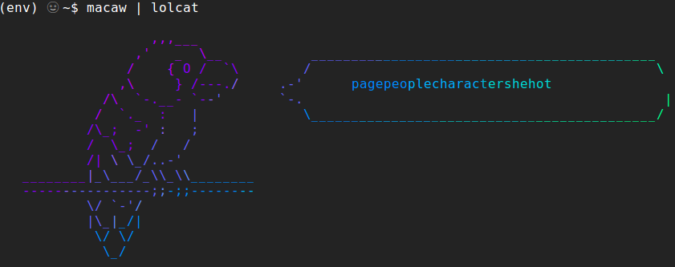

# Macaw

Better password generation inspired by our colorful, feathered friends that speak (often nonsensical) strings of words.

```
                   ,,,___
                 ,'   _  \__
                /    { O /  `\
               ,\     } /---./             _ __ ___   __ _  ___ __ ___      __
             /\  `-.__- `--'              | '_ ` _ \ / _` |/ __/ _` \ \ /\ / /
            /  `._  :   |                 | | | | | | (_| | (_| (_| |\ V  V /
           /\_;  -' :   ;                 |_| |_| |_|\__,_|\___\__,_| \_/\_/  
           /  \_;  /   /
           /| \ \_/..-'
   ________|_\___/_\\_\\________
   ----------------;;-;;--------
           \/ `-'/
           |\_|_/|
            \/ \/
             \_/

```
## Install

- `pip install macawspeak`

## About

- Macaw is a simple command-line tool to generate unique and easy-to-remember passwords.
- Macaw uses a dictionary of easy to remember but hard to guess words and strings them together to create unique passwords.
- Macaw supports lots of options for truly powerful and unique password generation.
- Unlike a real macaw, you can teach this one to not use certain words if desired.

## What makes a good password?

Passwords like `cUbXLBagmYPqKY35` are hard to guess, but they're also impossible to remember.

Meanwhile, passwords like [`correcthorsebatterystaple`](https://xkcd.com/936/)
are just as hard for computers to guess, but they are much easier for humans to remember.

Macaw seeks to generate passwords that are easy to remember so you don't have to dig into a password
manager every time you want to log into an app.

## Usage

`$ macaw`
- Generate and print a new password.

## Planned

`$ macaw generate`
- Generate a new random password based on pre-defined configuration.

`$ macaw speak`
- Uses the macaw ASCII art to output text.
  - Be default, macaw speak will generate a new password like "macaw generate" but with parrot ASCII.
    - Can also be verbose and use `$ macaw speak generate`

`$ macaw generate -n 5`
- Generate 5 passwords.

`$ macaw speak generate -n 5  (or $ macaw speak -n 5)`
- Generate 5 passwords with parrot ASCII.

`$ macaw speak -w 3`
- Generate a password with 3 words.

`$ macaw speak -w 4 -n 5`
- Generate 5 unique passwords with 4 words each with parrot ASCII.

`$ macaw speak silly`
- Generate a password without words and only random characters.

`$ macaw help`
- Show help page/usage guide.

`$ macaw update`
- Updates local dictionary.

`$ macaw configure`
- CLI to update config file with defaults for password generation.

`$ macaw seed <number>`
- Seed the random generator with a new number.
- Macaw will attempt to generate a random seed every time it is used (based on computer time).

`$ macaw blacklist "<word>"`
- Add a word to blacklist.

`$ macaw blacklist`
- Print blacklisted words.

`$ macaw speak smart`
- Generate a password in a "sensical" sentence of the form: <adjective><noun><verb><adverb>

`$ macaw speak bang`
- Add a `!` to the end of the password.

`$ macaw speak camel`
- Generate a password in CamelCase.

`$ macaw speak sub (o,0)`
- Generate a password and replace all `o` characters with `0` characters.

eg. `$ macaw speak smart camel bang sub (i,1)` --> "1ntell1gentBookcaseWaltzesAcc1dentally!"
*Ironically, MacawSpeakSmartCamelBangSub! is also a good password :wink:*

## Example:

```
$ macaw speak smart camel bang sub (i,1)

                   ,,,___
                 ,'   _  \__           ___________________________________________
                /    { O /  `\        /                                           \
               ,\     } /---./     .-'   1ntell1gentBookcaseWaltzesAcc1dentally!   |
             /\  `-.__- `--'       `-.                                             |
            /  `._  :   |             \___________________________________________/
           /\_;  -' :   ;
           /  \_;  /   /
           /| \ \_/..-'
   ________|_\___/_\\_\\________
   ----------------;;-;;--------
           \/ `-'/
           |\_|_/|
            \/ \/
             \_/
```

- You can also pipe the output to other programs:



## Build

- To build this package, you'll need `setuptools` and `wheel`.
  - `$ python3 -m pip install --user --upgrade setuptools wheel`
  - `$ python3 -m pip install --user --upgrade twine`
- Run this command from the directory where `setup.py` is located:
  - `$ python3 setup.py sdist bdist_wheel`
  - That should create some files in the `dist/` directory.
- You can now install this wheel package using pip if you desire.
  - `$ pip install dist/file_name.whl`
- If you wanted to upload the package to PyPi, you would need to use `twine`.

## Other

Macaw ASCII art inspired by the ASCII art on [Kiwitan's Parrot Blog](http://blog.kiwitan.com/2010/11/ascii-art-parrots.html)
